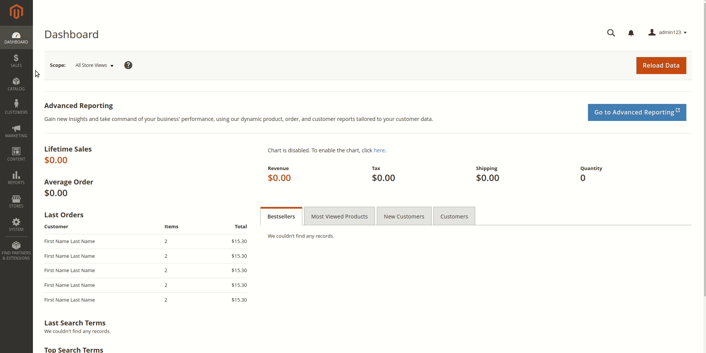

# Magento FAQ Module

This module provides a user-friendly FAQ section for your Magento 2 store, allowing customers to easily browse and find answers to common queries.

## Features:
- Add, edit, and manage FAQs from the admin panel
- Frontend FAQ display with accordion style
- Responsive design

